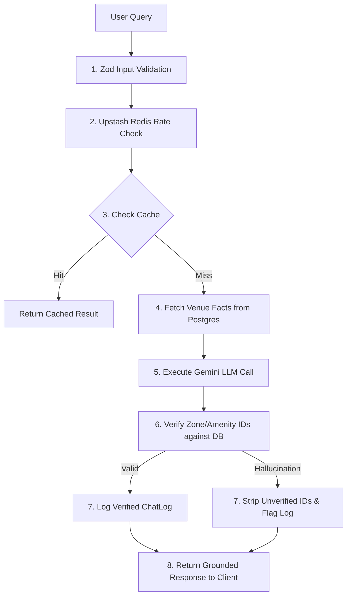

# 🏗️ StadiumPulse AI — Technical Architecture & Code Design

This document details the architectural principles, module decomposition, data streaming patterns, AI grounding guardrails, and security controls engineered into **StadiumPulse AI**.

---

## 🏛️ 1. Layered System Architecture

```
                    ┌─────────────────────────────────────────┐
                    │      Client Browser & PWA Engines        │
                    │   (Fan, Volunteer, Ops, Admin Portals)  │
                    └────────────────────┬────────────────────┘
                                         │
                                         │ HTTPS / SSE Stream
                                         ▼
                    ┌─────────────────────────────────────────┐
                    │       Next.js 16 App Router Edge        │
                    │     (Proxy Middleware & Security)      │
                    └────────────────────┬────────────────────┘
                                         │
                 ┌───────────────────────┼───────────────────────┐
                 ▼                       ▼                       ▼
      ┌────────────────────┐  ┌────────────────────┐  ┌────────────────────┐
      │ Fan Experience API │  │ Incident Copilot   │  │ Control Room SSE   │
      │  (/api/assistant)  │  │   (/api/copilot)   │  │ (/api/zones/stream)│
      └──────────┬─────────┘  └──────────┬─────────┘  └──────────┬─────────┘
                 │                       │                       │
                 ▼                       ▼                       ▼
      ┌──────────────────────────────────────────────────────────────────┐
      │                      Core Logic & Middleware                     │
      │  • Zod Validation     • Upstash Rate Limiter   • HMAC Auth       │
      │  • Gemini LLM Client  • Grounding Verification • Event Broadcaster│
      └──────────────────────────────────┬───────────────────────────────┘
                                         │
                                         ▼
                    ┌─────────────────────────────────────────┐
                    │         PostgreSQL (Supabase)           │
                    │       & Prisma ORM Entity Store         │
                    └─────────────────────────────────────────┘
```

---

## 📂 2. Module & Directory Structure

```
stadium-pulse/
├── app/
│   ├── (public)/              # Landing page & public entry points
│   ├── (fan)/                 # Fan Experience Portal (/fan, /assistant, /map, /navigation)
│   ├── (volunteer)/           # Volunteer Portal (/volunteer, /copilot, /tasks, /incidents)
│   ├── (ops)/                 # Control Room Console (/ops/dashboard, /sustainability)
│   ├── (admin)/               # Platform Governance (/admin, /venues, /prompts)
│   ├── (auth)/                # Authentication Portals (/login, /verify, /forgot-password)
│   └── api/                   # Type-safe API endpoints
│       ├── alerts/[id]/ack/   # Staff alert acknowledgement
│       ├── assistant/         # Multilingual Fan RAG Navigation API
│       ├── auth/              # Staff HMAC cookie auth
│       ├── copilot/           # Staff Incident Intake Copilot API
│       ├── incidents/         # Real-time incident CRUD
│       ├── transport/         # Transit status telemetry
│       └── zones/stream/      # Server-Sent Events (SSE) stream
├── components/                # Reusable React 19 UI components & layouts
├── hooks/                     # Custom React Hooks (useZoneStream SSE listener)
├── lib/
│   ├── ai/                    # Gemini LLM client, prompts, grounding guardrails
│   ├── auth.ts                # HMAC Web Crypto session token signing & verification
│   ├── broadcaster.ts         # Singleton EventBroadcaster for SSE connection pooling
│   ├── db.ts                  # Prisma ORM client singleton
│   ├── rate-limit.ts          # Serverless sliding-window rate limiter & memory fallback
│   ├── realtime.ts            # SSE event encoder & simulation bus
│   └── validators.ts          # Zod schema validation rules
└── tests/                     # Vitest test suite (20 tests across 6 files)
```

---

## ⚡ 3. Real-Time Telemetry & Event Stream Architecture

To support high-concurrency connections without exhausting database connection pools, StadiumPulse AI uses a **Global Event Broadcaster Singleton** (`lib/broadcaster.ts`):

1. **Single Background Loop**: A centralized `setInterval` tick queries zone occupancy, transport status, and waste bin fills every 3 seconds.
2. **Event Broadcaster Pattern**: When clients connect to `/api/zones/stream`, the SSE route registers a lightweight listener on `globalBroadcaster`.
3. **Automatic Lifecycle Management**: When the first client connects, broadcasting begins; when all clients disconnect, the background loop pauses automatically.
4. **SSE Event Protocol**:
   - `zone_update`: Live occupancy count & percentage.
   - `alert`: High/Critical density alerts with LLM situation summaries.
   - `transport_update`: Real-time shuttle bus and parking capacity.
   - `waste_bin_alert`: Sustainability threshold breaches (>85% fill).

---

## 🧠 4. GenAI RAG Grounding & Hallucination Defense

StadiumPulse AI implements **Code-Level Entity Verification** (`lib/ai/guardrails.ts`) rather than relying solely on LLM prompt instructions:



---

## 🔒 5. Security & Data Protection Controls

- **HMAC SHA-256 Web Crypto Tokens**: Staff session cookies (`sp_staff_session`) are signed using Web Crypto HMAC SHA-256 with timestamp expiration claims (`exp`).
- **Dual-Tier Rate Limiting**: Upstash Redis sliding-window rate limiter with automatic process-local in-memory fallback if Redis credentials are missing.
- **Production HTTP Security Headers**: Configured in `next.config.ts`:
  - `X-Frame-Options: DENY`
  - `X-Content-Type-Options: nosniff`
  - `Referrer-Policy: strict-origin-when-cross-origin`
  - `Permissions-Policy: camera=(), microphone=(), geolocation=(self)`
  - `Strict-Transport-Security: max-age=31536000; includeSubDomains`
- **Zero Raw Input Injection**: All user payloads are validated with Zod schemas before hitting Prisma ORM or LLM contexts.

---

## 🧪 6. Testing & Quality Assurance Summary

- **Type Safety**: 100% strict TypeScript types (`npx tsc --noEmit` returns 0 errors).
- **Code Quality**: ESLint (`npm run lint`) passes with **0 errors and 0 warnings**.
- **Test Suite**: Vitest suite (`npm run test`) runs **20 automated tests across 6 test suites**:
  1. `tests/threshold.test.ts` (3 tests)
  2. `tests/prompts.test.ts` (5 tests)
  3. `tests/guardrails.test.ts` (4 tests)
  4. `tests/middleware.test.ts` (2 tests)
  5. `tests/components.test.tsx` (2 tests)
  6. `tests/security.test.ts` (4 tests)
