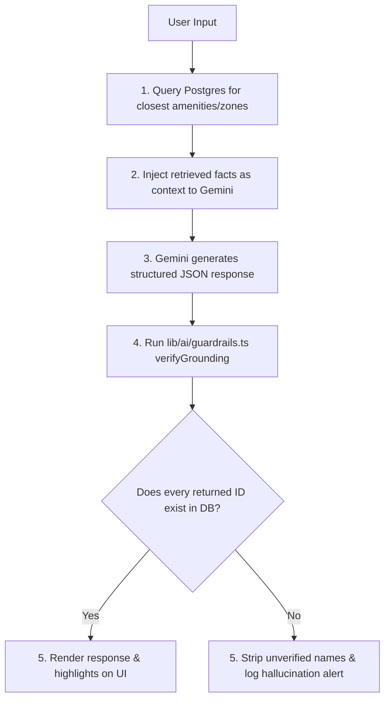

# 🏟️ StadiumPulse AI

**StadiumPulse AI** is a GenAI-enabled operations layer, spectator navigation companion, and control room platform built for large-scale sports venues. Consolidating spectator navigation, volunteer dispatch, and staff control room operations into a single Next.js application, the platform uses real-time event streaming, high-fidelity Stitch UI designs, and LLM orchestration to translate stadium telemetry into grounded, actionable insights.

---

## 🎨 UI & Design Aesthetics (Stitch Design System)

The platform is designed using a state-of-the-art dark obsidian and cyan telemetry design system built across 34 custom UI screen specifications:
* **Color Palette**: Dark Obsidian background (`#101415`), Surface Containers (`#1d2022`, `#272a2c`), Electric Cyan Highlights (`#00f2ff`), and Telemetry Green Status (`#5cf968`).
* **Typography**: Montserrat, Geist, Inter, and Material Symbols Outlined icons.
* **Responsive Web & Mobile Architecture**:
  * **Desktop Web View**: Expands into full 12-column responsive layouts (`max-w-7xl mx-auto`) with a top header navigation bar, side-by-side data telemetry panels, and desktop quick action shortcuts.
  * **Mobile Touch View**: Compact, touch-friendly layouts with a floating bottom navigation dock, mobile category chips, and swipeable cards.

---

## 🚀 Key Features & Portals

### 1. 🗺️ Fan Experience Portal (`/fan/*`)
* **AI Search & Chat Assistant (`/fan/assistant`)**: Multilingual RAG assistant for route advice, food recommendations, and facility questions.
* **Interactive Stadium Map (`/fan/map`)**: Google Maps integration with facility filters (Food Courts, Medical, Restrooms, Parking) and guided polyline routes.
* **Indoor Wayfinding (`/fan/navigation`)**: Turn-by-turn indoor directions with accessible elevator route toggles and nearby POIs.
* **Amenities & Wait Times (`/fan/amenities`)**: Real-time concourse wait time tracking, distance indicators, and service availability status.
* **Live Crowd Density (`/fan/crowd`)**: Zone-by-zone density gauges, congestion alerts, and AI-suggested alternate route recommendations.
* **Transport & Parking (`/fan/transport`)**: Real-time shuttle bus countdowns, parking lot capacity meters, and transit alerts.
* **Accessibility Services (`/fan/accessibility`)**: 1-Tap live volunteer assistance requests, wheelchair route guides, and elevator statuses.
* **Emergency SOS (`/fan/emergency`)**: 1-Tap Emergency SOS button with live geolocation broadcast and direct hotline dispatch.
* **System Settings (`/fan/settings`)**: Multilingual selector (English, Hindi, Marathi, Arabic, French, Spanish), high contrast UI toggles, and PWA offline cache engine.

### 2. 🚨 Control Room & Operational Intelligence (`/ops/*`)
* **Master Console (`/ops/dashboard`)**: Staff control-room dashboard displaying real-time occupancy updates per stadium zone pushed via a unified Server-Sent Events (SSE) bus.
* **Live Situation Feed**: Automatically triggers LLM-powered situation reports and recommended actions when warning (85%) or critical (95%) thresholds are crossed.
* **Anti-Spam Cooldown**: Uses a 60-second cooldown window per zone to prevent threshold oscillation ("flapping") from flooding staff with repeat alerts.
* **Acknowledge Workflow**: Permits staff to acknowledge live alerts, instantly persisting states back to the database.
* **Emergency Lockdown**: One-click master lockdown controls for crisis containment.

### 3. 🛡️ Volunteer & Staff Incident Copilot (`/volunteer/*`)
* **Duty Operations Dashboard (`/volunteer`)**: Active duty status toggle, assigned tasks feed, active incident alerts, and quick copilot launcher.
* **Two-Panel Intake Workspace (`/volunteer/copilot`)**: Staff and volunteers type/speak unstructured incident reports on the left; the copilot drafts structured tickets on the right.
* **Smart Matchmaking**: Queries availability and zone assignments to automatically suggest the nearest available volunteer.
* **Localized Dispatch Translation**: Generates dispatch notifications translated into the target volunteer's preferred language.

### 4. ⚙️ Admin & Governance Portal (`/admin/*`)
* **Admin Dashboard (`/admin`)**: Platform governance executive stats, multi-venue quick management, and system auditing.
* **Venue & Event Control (`/admin/venues`)**: Configure seating capacities, zone polygon boundaries, and tournament schedules.
* **AI Prompt & Grounding Config (`/admin/prompts`)**: Tune system prompts and RAG grounding guardrails.

### 5. 🔐 Unified Authentication (`/login`)
* **Role-Based Portal Access**: Single login interface supporting Fan, Volunteer, Ops Staff, and Admin roles with passcode and session token verification.

---

## 🛠️ Technology Stack

* **Framework**: Next.js 16 (App Router, React 19, TypeScript)
* **Styling**: Tailwind CSS v4 (`@theme` definitions), Vanilla CSS Glassmorphism
* **Typography & Icons**: Montserrat, Geist, Inter, Lucide React & Google Material Symbols Outlined
* **Maps Integration**: Google Maps API (`@react-google-maps/api`)
* **Database & ORM**: PostgreSQL (Supabase) & Prisma ORM
* **Caching & Rate Limiting**: Upstash Redis (primary serverless sliding-window rate limiter) with a built-in process-local in-memory fallback.
* **AI Orchestration**: Google Gemini SDK (`@google/generative-ai`)
* **Real-time Protocol**: Server-Sent Events (SSE)
* **Testing**: Vitest (Unit & Integration tests)

---

## 📂 System Architecture

```
stadium-pulse/
├── app/
│   ├── (public)/          # Landing page & public entry points
│   ├── (fan)/             # Fan Experience Portal (/fan, /assistant, /map, /navigation, etc.)
│   ├── (volunteer)/       # Volunteer Portal (/volunteer, /copilot, /tasks, /incidents)
│   ├── (ops)/             # Control Room / Ops Console (/ops/dashboard, /sustainability)
│   ├── (admin)/           # Platform Governance (/admin, /venues, /prompts, /users)
│   ├── (auth)/            # Unified Authentication (/login, /verify)
│   └── api/               # Server API Route endpoints
├── components/            # Reusable UI Components & Layouts
│   ├── alerts/            # AlertCard & Telemetry Feed components
│   ├── chat/              # ChatWindow AI assistant component
│   └── layout/            # FanShell, Navbars, Sidebars
├── hooks/                 # React Hooks (useZoneStream SSE client)
├── lib/
│   ├── ai/                # Prompts, LLM client, and Grounding guardrail helpers
│   ├── auth.ts            # Staff session cookies and helper methods
│   ├── db.ts              # Prisma Client singleton
│   ├── rate-limit.ts      # Redis token-bucket config
│   └── realtime.ts        # SSE event stream handlers and simulator helpers
└── tests/                 # Vitest spec suites (threshold checks, prompt tests, component tests)
```

---

## 💾 Database Schema & Entities

The application shares a single schema definition containing **9 database entities** managed via Prisma:

| Entity | Fields | Description |
| :--- | :--- | :--- |
| **`Venue`** | `id` (UUID), `name`, `tournamentId`, `timezone` | Main sports stadium hosting tournament matches. |
| **`Zone`** | `id`, `venueId` (FK), `name`, `capacity`, `currentCount`, `warningThreshold`, `criticalThreshold`, `geoPolygon` (JSON) | Physical seating stand or concourse area. |
| **`Amenity`** | `id`, `zoneId` (FK), `type` (Enum), `name`, `accessibilityFlags` (JSON), `status` (Enum) | Facilities inside zones (Restrooms, Lifts, Medical Rooms). |
| **`Incident`** | `id`, `category` (Enum), `zoneId` (FK), `priority` (Enum), `status` (Enum), `assignedVolunteerId` (FK), `createdBy`, `description` | Active incidents reported by volunteers or operators. |
| **`Volunteer`** | `id`, `name`, `preferredLanguage`, `zoneAssignmentId` (FK), `availability` (Enum), `contactChannel` | Stadium staff details for scheduling and dispatch tasks. |
| **`ChatLog`** | `id`, `sessionId`, `query`, `detectedLanguage`, `response`, `groundedSources` (JSON Array), `flaggedHallucination` (Boolean) | Log of fan-facing assistant interactions for grounding audits. |
| **`AlertLog`** | `id`, `zoneId` (FK), `thresholdCrossed` (Enum), `generatedSummary`, `recommendedAction`, `acknowledged` (Boolean), `acknowledgedBy` | Log of active and historical threshold breach alerts. |
| **`TransportZone`** | `id`, `name`, `type` (Enum), `capacity`, `currentCount` | Parking structures and shuttle pickup hubs for fans. |
| **`WasteBin`** | `id`, `zoneId` (FK), `fillPct` (Float), `lastUpdated` | Trash monitors tracking stadium sustainability. |

---

## 🧠 Google Gemini Integration & Guardrail Logic

### Grounding Verification Flow
To prevent Gemini from hallucinating gates, locations, or facilities that do not exist, the app uses **database-backed verification** rather than relying solely on prompting guidelines:



---

## ⚙️ Environment Configuration

Create a `.env` file in the root of `stadium-pulse`:

```env
# ─── Database (Supabase PostgreSQL) ──────────────────────────
DATABASE_URL="postgresql://postgres:[user]:[password]@[project-ref].supabase.co:5432/postgres"
DIRECT_URL="postgresql://postgres:[user]:[password]@[project-ref].supabase.co:5432/postgres"

# ─── Redis (Upstash) ────────────────────────────────────────
UPSTASH_REDIS_REST_URL="https://[endpoint-name].upstash.io"
UPSTASH_REDIS_REST_TOKEN="your-token-here"

# ─── AI / LLM (Google Gemini) ───────────────────────────────
GEMINI_API_KEY="your-gemini-api-key"

# ─── Google Maps ─────────────────────────────────────────────
NEXT_PUBLIC_GOOGLE_MAPS_API_KEY="your-google-maps-api-key"

# ─── App Settings ────────────────────────────────────────────
NEXT_PUBLIC_APP_URL="http://localhost:3000"
NODE_ENV="development"
```

---

## 🛠️ Installation & Setup

1. **Install Dependencies**:
   ```bash
   cd stadium-pulse
   npm install
   ```

2. **Sync Database Schema**:
   ```bash
   npx prisma db push
   ```

3. **Seed Database Records**:
   ```bash
   npx prisma db seed
   ```

4. **Run Development Server**:
   ```bash
   npm run dev
   ```
   Open `http://localhost:3000` in your browser.

---

## 🧪 Testing

The codebase includes an extensive Vitest test suite validating threshold logic, SSE component streams, rate limiting, and prompt grounding:

```bash
npm run test
```

**Test Status**: All 16 unit & integration tests across 5 test suites pass cleanly.
