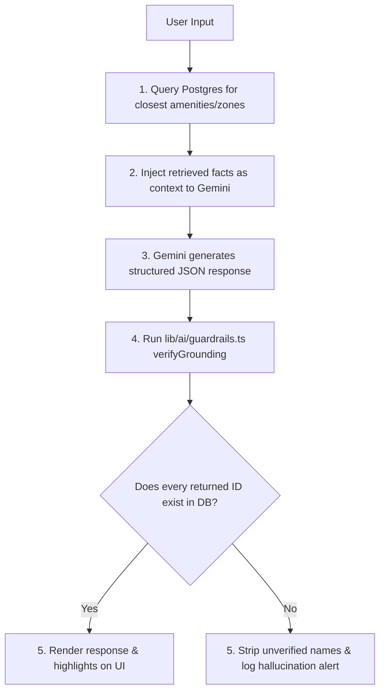

# 🏟️ StadiumPulse AI

**StadiumPulse AI** is a GenAI-enabled operations layer and tournament companion platform built for large-scale sports venues. Consolidating spectator navigation and staff control room operations into a single Next.js application, the platform uses real-time event streaming and LLM orchestration to translate stadium telemetry into grounded, actionable insights.

---

## 🚀 Key Features

### 1. 🗺️ Multilingual AI Navigation & Accessibility Assistant (FR-1)
* **Intelligent Wayfinding**: Provides spectators with step-by-step route sequences (zone-to-zone transitions) and walking estimates based on indoor layouts.
* **Hard Grounding**: Constrained strictly to pre-fetched database facts using server-side guardrails. It refuses to invent gates, routes, or facilities.
* **Multilingual Capability**: Out-of-the-box support for **English**, **Hindi**, and **Marathi** with automatic query language detection.
* **Session Follow-up Context**: Retains conversational history for multi-turn queries (e.g., asking "is there a lift near it?" resolves against the last-mentioned route).

### 2. 🚨 Real-Time Crowd & Operational Intelligence (FR-2)
* **Live Heatmap**: Staff control-room dashboard displays real-time occupancy updates per stadium zone pushed via a unified Server-Sent Events (SSE) bus.
* **Situation Feed**: Automatically triggers LLM-powered situation reports and recommended actions when warning (85%) or critical (95%) thresholds are crossed.
* **Anti-Spam Cooldown**: Uses a 60-second cooldown window per zone to prevent threshold oscillation ("flapping") from flooding staff with repeat alerts.
* **Acknowledge Workflow**: Permits staff to acknowledge live alerts, instantly persisting states back to the database.

### 3. 🛡️ Volunteer / Staff Incident Copilot (FR-3)
* **Two-Panel Intake Workspace**: Staff and volunteers type/speak unstructured incident reports on the left; the copilot drafts structured tickets on the right.
* **Smart Matchmaking**: Queries availability and zone assignments to automatically suggest the nearest available volunteer.
* **Localized Dispatch Translation**: Generates dispatch notifications translated into the target volunteer's preferred language.
* **Human-in-the-loop Confirmation**: Requires explicit dispatcher verification before creating the incident record and dispatching volunteers.

### 4. ♻️ Sustainability & Transport Nudges (FR-4)
* **Unified Event Bus**: Reuses the main SSE connection stream, removing the need for duplicate pipelines.
* **Fan Transport View**: Real-time progress indicators showing parking lot and shuttle capacity to guide fans to open transport routes.
* **Ops Sustainability Feed**: Consolidates waste bin monitor metrics, automatically flagging bins exceeding 85% capacity for collection.

---

## 🛠️ Technology Stack

* **Framework**: Next.js 14/15 (App Router, TypeScript)
* **Styling**: Tailwind CSS & shadcn/ui
* **Database / ORM**: PostgreSQL (Supabase) & Prisma ORM
* **Caching & Rate Limiting**: Upstash Redis (primary serverless sliding-window rate limiter) with a built-in process-local in-memory fallback for local development or unconfigured states.
* **AI Orchestration**: Google Gemini SDK (`@google/generative-ai`)
* **Real-time Protocol**: Server-Sent Events (SSE)
* **Testing**: Vitest (Unit & Integration tests)

---

## 📂 System Architecture

The application uses Next.js Route Groups to segregate interfaces within a single codebase, preventing asset/bundle bleed while maintaining a shared database schema:

```
stadium-pulse/
├── app/
│   ├── (public)/          # Unauthenticated entry page & auth gate routes
│   ├── (fan)/             # Spectator views (/assistant, /transport, /map)
│   ├── (ops)/             # Control room views (/dashboard, /copilot, /sustainability)
│   └── api/               # API route endpoints
├── components/            # Shared UI components (ChatWindow, AlertCard, layouts)
├── lib/
│   ├── ai/                # Prompts, LLM client, and Grounding guardrail helpers
│   ├── auth.ts            # Staff session cookies and helper methods
│   ├── db.ts              # Prisma Client singleton
│   ├── rate-limit.ts      # Redis token-bucket config
│   └── realtime.ts        # SSE event stream handlers and simulator helpers
└── tests/                 # Vitest spec suites (threshold checks, prompt structure tests)
```

---

## 💾 Database Schema & Entities

The application shares a single schema definition containing **9 database entities** managed via Prisma:

| Entity | Fields | Description |
| :--- | :--- | :--- |
| **`Venue`** | `id` (UUID), `name`, `tournamentId`, `timezone` | Main sports stadium hosting the tournament matches. |
| **`Zone`** | `id`, `venueId` (FK), `name`, `capacity`, `currentCount`, `warningThreshold`, `criticalThreshold`, `geoPolygon` (JSON) | Physical seating stand or concourse area within the venue. |
| **`Amenity`** | `id`, `zoneId` (FK), `type` (Enum), `name`, `accessibilityFlags` (JSON), `status` (Enum) | Facilities inside zones (e.g. Restrooms, Lifts, Medical Rooms). |
| **`Incident`** | `id`, `category` (Enum), `zoneId` (FK), `priority` (Enum), `status` (Enum), `assignedVolunteerId` (FK), `createdBy`, `description` | Active incidents reported by volunteers or operators. |
| **`Volunteer`** | `id`, `name`, `preferredLanguage`, `zoneAssignmentId` (FK), `availability` (Enum), `contactChannel` | Stadium staff details for scheduling and dispatch tasks. |
| **`ChatLog`** | `id`, `sessionId`, `query`, `detectedLanguage`, `response`, `groundedSources` (JSON Array), `flaggedHallucination` (Boolean) | Log of fan-facing assistant interactions for grounding audits. |
| **`AlertLog`** | `id`, `zoneId` (FK), `thresholdCrossed` (Enum), `generatedSummary`, `recommendedAction`, `acknowledged` (Boolean), `acknowledgedBy` | Log of active and historical threshold breach alerts. |
| **`TransportZone`** | `id`, `name`, `type` (Enum), `capacity`, `currentCount` | Parking structures and shuttle pickup hubs for fans. |
| **`WasteBin`** | `id`, `zoneId` (FK), `fillPct` (Float), `lastUpdated` | Trash monitors tracking stadium sustainability. |

---

## 🧠 Google Gemini Integration & Guardrail Logic

### Grounding Verification Flow
To prevent Gemini from hallucinating gates, locations, or facilities that do not exist, the app uses **database-backed verification** rather than relying solely on prompting guidelines:



The output post-processing code (`lib/ai/guardrails.ts`) matches every ID or zone name referenced in the route output:
```typescript
export async function verifyGrounding(
  llmResponse: string,
  mentionedZoneIds: string[],
  mentionedAmenityIds: string[]
) {
  // Queries DB to check if the mentioned IDs are legitimate
  // Returns cleaned text and sets flaggedHallucination = true if any fail
}
```

---

## 📡 API Contract Specification

### 1. `POST /api/assistant` (Fan Assistant RAG)
* **Request Payload**:
  ```json
  {
    "session_id": "session-123",
    "query": "Where is the nearest wheelchair toilet?",
    "current_zone_id": "zone_a"
  }
  ```
* **Response Payload**:
  ```json
  {
    "detected_language": "en",
    "answer": "The nearest accessible restroom is Restroom-3 located in Zone C near Gate 2/3.",
    "route": ["zone_a", "zone_c"],
    "estimated_walk_time_min": 4,
    "grounded_sources": ["amenity_restroom_3"]
  }
  ```

### 2. `POST /api/copilot` (Staff Incident Copilot)
* **Request Payload**:
  ```json
  {
    "reporter_id": "vol_arjun",
    "description": "Medical issue - someone collapsed in the South Stand concourse"
  }
  ```
* **Response Payload**:
  ```json
  {
    "draft_incident": {
      "category": "medical",
      "zone_id": "zone_b",
      "priority": "critical",
      "description": "Someone collapsed in the South Stand concourse."
    },
    "suggested_volunteer": {
      "id": "vol_meena",
      "name": "Meena Patel",
      "language": "hi",
      "zone_assignment": "zone_b"
    },
    "dispatch_message_localized": "साउथ स्टैंड कॉनकोर्स में आपातकालीन चिकित्सा स्थिति। कृपया तुरंत वहां पहुंचें।",
    "requires_confirmation": true
  }
  ```

### 3. `GET /api/zones/stream` (SSE Event Bus)
The server broadcasts events using the Server-Sent Events protocol:
* **Zone Updates (`event: zone_update`)**:
  ```json
  {
    "type": "zone_update",
    "zone_id": "zone_a",
    "zone_name": "Zone A",
    "current_count": 4200,
    "capacity": 8000,
    "pct": 0.53
  }
  ```
* **Alert Events (`event: alert`)**:
  ```json
  {
    "type": "alert",
    "zone_id": "zone_c",
    "zone_name": "Zone C",
    "threshold_crossed": "critical",
    "generated_summary": "Zone C is over 95% capacity and increasing.",
    "recommended_action": "Redirect traffic through Gate 7 overflow.",
    "alert_id": "alert-log-uuid",
    "timestamp": "2026-07-18T16:00:00Z"
  }
  ```

---

## ⚙️ Environment Configuration

Create a `.env` file in the root directory:

```env
# ─── Database (Supabase PostgreSQL) ──────────────────────────
DATABASE_URL="postgresql://postgres:[user]:[password]@[project-ref].supabase.co:5432/postgres"
DIRECT_URL="postgresql://postgres:[user]:[password]@[project-ref].supabase.co:5432/postgres"

# ─── Redis (Upstash) ────────────────────────────────────────
UPSTASH_REDIS_REST_URL="https://[endpoint-name].upstash.io"
UPSTASH_REDIS_REST_TOKEN="your-token-here"

# ─── AI / LLM (Google Gemini) ───────────────────────────────
GEMINI_API_KEY="your-gemini-api-key"

# ─── App Settings ────────────────────────────────────────────
NEXT_PUBLIC_APP_URL="http://localhost:3000"
NODE_ENV="development"
```

### 🔒 Rate Limiting & Fallback Details
The application relies on sliding-window rate limiting to protect LLM endpoints:
* **Primary Rate Limiter**: Driven by **Upstash Redis**. Requires `UPSTASH_REDIS_REST_URL` and `UPSTASH_REDIS_REST_TOKEN` env variables.
* **In-Memory Fallback**: If Redis variables are missing or connection fails, the application falls back to a process-local in-memory token bucket limiter.
* **Production Limitations with Fallback**: The fallback in-memory rate-limiter is **process-local**. In serverless configurations (e.g. Vercel Serverless Functions) or multi-instance deployments:
  * Limit counts are not shared across separate runtime instances or server containers.
  * Reset triggers on server restarts or serverless cold starts, which can allow client sessions to exceed rate-limit thresholds.
  * In production environments, it is highly recommended to configure Upstash Redis to ensure centralized, cluster-wide rate limit enforcement.

---

## 🛠️ Installation & Setup

1. **Install Dependencies**:
   ```bash
   npm install
   ```

2. **Sync Database Schema**:
   Prisma will map the entities directly into your Supabase database:
   ```bash
   npx prisma db push
   ```

3. **Seed Database Records**:
   Seed the database with pre-configured stadium zones, transport hubs, waste bins, amenities, and staff mock entries:
   ```bash
   npx prisma db seed
   ```

4. **Run Development Server**:
   ```bash
   npm run dev
   ```
   Open `http://localhost:3000` to select a portal (Fan View or staff Ops Console).

---

## 🧪 Testing

The codebase includes an extensive Vitest test suite that validates mathematical threshold limits, rate-limit cooldown windows, and LLM prompt serialization:

* **Run all tests**:
  ```bash
  npm run test
  ```

* **Verify test coverage**:
  ```bash
  npx vitest run --coverage
  ```
